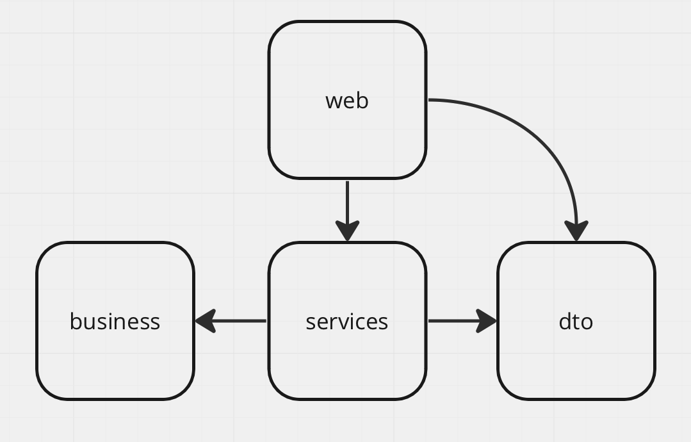

# Архитектура системы #

Стрелками показаны зависимости

# Описание модулей #

## web ##
Cодержит контроллеры (4 класса для операций над проектами, задачами, сотрудниками, командами)

## business ##
Содержит два пакета: model и repositories, где хранятся jpa-репозитории с таблицами и entity

## services ##
Логика приложения

## dto ##
Содержит классы для передачи данных

# Задачи #
1. Создать обьекты в пакете model
2. Создать репозитории
3. Написать контроллеры и сервисы
4. Добавить аутентификацию
5. Добавить логи
6. Добавить тесты
7. Разработать Docker файл

# Тест-кейсы #
https://docs.google.com/document/d/1hI-4PEIHHa2t2ZnYOqcA5uZQ2tmyzlLdoiIbAtqhqAk/edit?usp=sharing