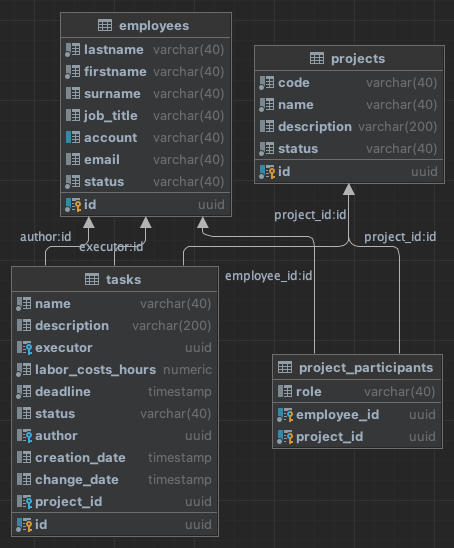

# База данных #

# Employees #
1. id уникальный идентификатор (not null) (т.к. account может быть null)
2. lastname (not null) Фамилия
3. firstname (not null) Имя
4. surname Отчество
5. jobtitle Должность
6. account (unique) Учетная запись
7. email Адрес электронной почты
8. status (not null) Статус сотрудника

# Project #
1. id уникальный идентификатор 
2. code (unique, not null) Код проекта
3. name (not null) Наименование
4. description Описание
5. status (not null) Статус проекта

# ProjectParticipants #
1. id (not null) уникальный идентификатор
2. employeeid (not null) идентификатор сотрудника
3. projectid (not null) идентификатор проекта
4. role роль сотрудника

# Tasks #
1. id (not null) уникальный идентификатор
2. name (not null) Наименование задачи
3. description Описание
4. executor Исполнитель задачи
5. laborcostshours (not null) Трудозатраты
6. deadline (not null) Крайний срок
7. status Статус задачи
8. author Автор задачи
9. creationdate Дата создания
10. changedate Дата последнего изменения задачи